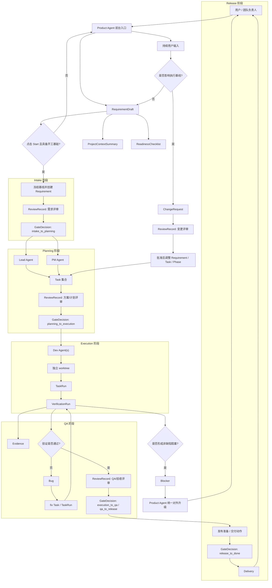
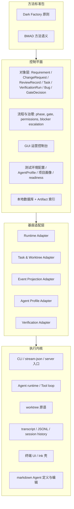
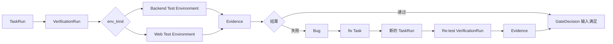
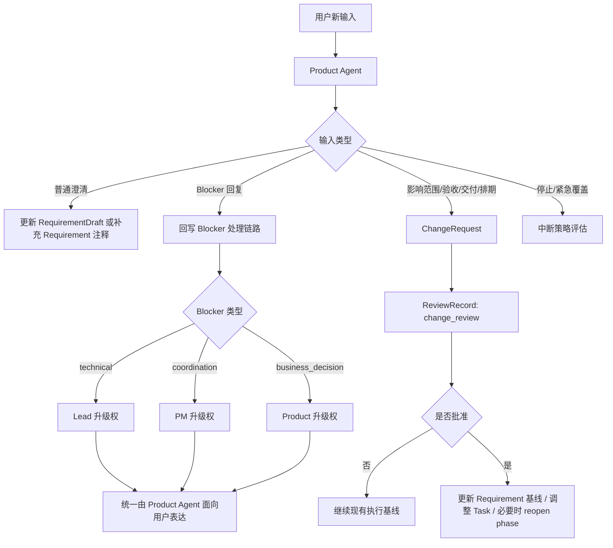

# 基于 ClaudeCode 实现的全自动代码工厂（ACF）实施蓝图

## 1. 文档定位与阅读方式

本文件是“基于 ClaudeCode 实现的全自动代码工厂（ACF）”的唯一实施蓝图，用于统一以下内容：

- 需求定义
- 首期范围与非目标
- 可行性论证
- 系统设计
- 详细设计
- 实施任务拆分
- 后续路线图
- 风险与前提

本文件承接并统一了此前的立项、评审与预设计结论，不再依赖多个平行入口文档。

相关方法与背景材料保留为参考输入：

- [dark-factory-development-pattern.md](./claude-code-reference/method-sources/dark-factory-development-pattern.md)
- [bmad-standard-evaluation.md](./claude-code-reference/method-sources/bmad-standard-evaluation.md)
- [00-architecture-overview.md](./claude-code-reference/00-architecture-overview.md)

阅读建议：

1. 先读第 2、3、4 章，理解项目目标、首期范围和可行性边界。
2. 再读第 5 章，掌握系统流程和分层架构。
3. 第 6 章用于对象模型、字段和规则的统一口径。
4. 第 7 章可直接转为 backlog 或里程碑拆分。

本文件的基本约束如下：

- 详细设计只覆盖首期 `MVP`
- 中后期能力只保留高层路线图
- 图表统一使用 `Mermaid`
- 当前仓库被视为执行内核和基座，不被视为现成控制平面

---

## 2. 项目需求

### 2.1 问题定义

当前 AI 编码工具大多擅长单点编码和局部修改，但不擅长支撑完整研发闭环。真实软件交付要求以下能力同时存在：

- 需求澄清与冻结
- 多角色分工
- 跨任务协作与隔离
- 验证证据留存
- 缺陷回流
- 质量门禁
- 过程可观察与可审计

因此，`ACF` 的目标不是继续强化“单 Agent 工具”，而是构建一层面向组织交付的控制平面，让 AI 从“局部协助者”变成“受控研发团队”。

### 2.2 目标用户

本项目的目标用户有两类。

第一类是组织/团队管理者：

- 需要观察项目状态、角色状态、缺陷状态和交付风险
- 需要将 AI 使用方式沉淀为团队制度、模板和标准流程
- 需要控制研发质量，而不是仅接受黑盒产出

第二类是项目执行者：

- 需要以更低的人工搬运成本把需求变成任务和验证闭环
- 需要让多个 Agent 在一致边界下协作
- 需要通过明确证据和回流机制减少返工

### 2.3 核心目标

首期必须同时满足以下目标：

- 将用户输入沉淀为结构化需求，而不是停留在会话上下文
- 通过 `RequirementDraft -> Start -> Requirement` 完成需求冻结
- 让 `Product / PM / Lead / Dev / QA` 角色各自承担清晰职责
- 让任务、运行、验证、缺陷和门禁都具备结构化记录
- 将 Backend 与 Web 验证纳入同一治理语言
- 让用户从单一前台入口发起需求和接收阻塞升级
- 让 GUI 承担运营控制台职能，而不是对话壳的视觉包装

### 2.4 核心场景

项目首期围绕如下主场景构建：

`RequirementDraft -> Start -> Requirement -> Planning -> Execution -> Verification -> Bug/Blocker -> GateDecision -> Delivery`

该场景要求：

- 用户可以持续输入需求
- 正式执行基线只能通过 `Start` 或批准后的 `ChangeRequest` 变更
- 执行和验证必须可归因到具体 `TaskRun`、`VerificationRun` 和代码版本
- `QA` 可以否决，`Lead / PM` 分阶段推进，`Product` 统一前台表达

### 2.5 首期成功标准

若首期达到以下标准，即视为闭环成立：

- 至少一类真实项目可稳定跑通 `需求 -> 开发 -> 验证 -> 回流 -> 交付`
- 需求与执行状态不再依赖聊天上下文恢复
- Backend 与 Web 两类验证都能产生结构化 `VerificationRun` 和 `Evidence`
- `Bug`、`Blocker`、`GateDecision`、`ReviewRecord` 能支持最小治理链路
- GUI 可用于观察项目、任务、验证、缺陷和阶段状态
- 角色模板和流程模板可在多个项目间复用

---

## 3. 首期范围与非目标

### 3.1 首期核心闭环 MVP

首期 `MVP` 只承诺以下最小闭环能力：

- 需求入口与 `RequirementDraft`
- `Start` 冻结需求并生成正式 `Requirement`
- 轻量 `ProjectContextSummary`
- 轻量 `ReadinessChecklist`
- 基于 `Requirement` 的正式评审与 `GateDecision`
- 面向 `Lead / Dev / QA` 的任务与运行对象
- `Backend Test Environment` 与 `Web Test Environment`
- `VerificationRun / Evidence / Bug / Blocker` 回流链路
- 基础 GUI 运营控制台
- 基于当前仓库 runtime 的可接入适配层

### 3.2 同阶段增强项

以下能力可在首期同阶段追加，但不应和核心闭环混写为同一层级的最小承诺：

- 更丰富的角色模板
- 项目级 Agent 模型覆盖
- 更细粒度的可视化看板
- 阶段重开链路增强
- 更细化的验证产物展示
- 更丰富的审计与统计视图

### 3.3 首期非目标

首期明确不做以下内容：

- 移动端模拟器与真机测试编排
- 游戏运行环境与游戏自动化测试
- 云设备农场与复杂硬件依赖验证
- 面向所有客户端形态的一体化测试基座
- 图形化流程画布
- 复杂的图形化编排器
- 直接照搬 BMAD 全量文件体系
- 直接照搬外部方法标准的命令式运行形态
- 完整的组织级服务端协同平台

### 3.4 首期范围边界说明

首期的明确边界是：

- 以本地优先控制平面为中心
- 以当前仓库作为执行内核
- 以 Backend/Web 两类验证作为首期测试边界
- 以轻量项目画像和开工检查作为方法吸收落点
- 以 `MVP` 可运行闭环为目标，而不是一次性完成完整企业平台

---

## 4. 可行性论证

### 4.1 可行性判断总览

本项目被判断为“方向可行、路径清晰、但需要明确新增子系统”的项目。  
可行性的核心判断来自三层：

1. 当前仓库具备足以复用的执行基座
2. 一部分现有能力可上浮为控制平面原语
3. 控制平面的关键能力虽然需要新建，但工程边界可被明确收敛

### 4.2 直接可复用的基座能力

| 能力 | 当前基座现状 | 在本项目中的作用 | 可行性结论 |
| --- | --- | --- | --- |
| Agent runtime | 当前仓库已经具备多 Agent 执行、工具调用和后台任务循环 | 作为执行内核复用 | 高可行 |
| 工具系统 | 已有工具框架、权限模式和工具路由 | 作为执行面基础设施复用 | 高可行 |
| CLI / stream-json / server 入口 | 已存在稳定入口面 | 作为控制平面与 runtime 的可接入面 | 高可行 |
| worktree 原语 | 已有 `--worktree`、`EnterWorktree`、Agent 隔离选项 | 作为写任务隔离基础能力 | 高可行 |
| transcript / JSONL 留痕 | 已有会话记录、事件留痕和历史恢复基础 | 作为审计和追溯的底层证据来源之一 | 高可行 |
| 终端 UI 壳 | 当前仓库已有较完整的终端侧 Ink UI | 可复用为执行壳和状态可视化参考 | 高可行 |
| Agent 定义与文件编辑 | 已有 agent markdown 加载与编辑能力 | 可作为首期 AgentProfile 的底层来源之一 | 高可行 |

### 4.3 可复用原语但需上浮适配

| 原语 | 当前现状 | 不足之处 | 上浮方向 | 可行性结论 |
| --- | --- | --- | --- | --- |
| 任务系统 | 当前更接近文件化 todo substrate | 不是工厂级 `Task / TaskRun` 模型 | 复用并发、刷新、隔离模式，上浮为控制平面任务对象 | 可行 |
| 结构化会话事件 | 当前主要是 transcript / stream event | 不是 `RequirementDraft / ChangeRequest / ReviewRecord` 业务对象 | 建立对象投影层和一致性写入层 | 可行 |
| Agent 编辑 | 当前是 markdown 文件读写 | 不是治理系统 | 作为 `AgentProfile` 的底层配置来源 | 可行 |
| worktree 使用方式 | 当前是原语和可选隔离方式 | 不是默认调度策略 | 由控制平面策略层决定何时启用 | 可行 |
| 终端 UI 组件 | 当前服务于 CLI | 不是首期 GUI 控制台 | 作为交互模式和组件思想参考 | 可行 |

### 4.4 明确新增但可行的新子系统

| 新子系统 | 为什么需要新建 | 为什么仍然可行 |
| --- | --- | --- |
| 控制平面对象层 | 当前仓库没有正式需求、评审、门禁、变更等对象模型 | 业务边界已经在现有文档中收敛，新增对象集范围可控 |
| 本地数据库与对象存储索引层 | 当前基座没有控制平面数据库 | 本地优先架构明确，首期只需支持单机客户端闭环 |
| runtime 适配层 | 当前有入口，但没有专门面向控制平面的驱动边界 | `CLI / stream-json / server` 提供了稳定接入面，可后续选定主路径 |
| Backend/Web 测试基座 | 当前仓库根部没有现成平台测试基座 | 范围已收敛到两类环境，且上层结果模型统一 |
| 正式评审链与门禁系统 | 当前 transcript 不能替代正式评审对象 | `ReviewRecord + GateDecision` 的业务边界明确 |
| GUI 运营控制台 | 当前仓库是终端 UI，不是多项目控制台 | 首期 GUI 范围已收敛为运营控制台，不做重交互画布 |

### 4.5 可行性前提

以下内容属于当前方案的前提，不应在后续被弱化掉：

- 项目基于当前仓库继续开发，不重写执行内核
- 控制平面当前阶段只要求证明存在稳定接入面，例如 `CLI / stream-json / server`
- Backend 与 Web 测试环境首期都保留，但都按新增测试基座建设
- `ProjectContextSummary` 与 `ReadinessChecklist` 以首期轻量机制进入，而不是完整重对象体系
- 控制平面状态必须能锚定到代码版本或 `worktree` 快照
- demo 证明的是 Dark Factory 工作法可跑通，而不是平台控制平面已经存在
- 真实项目的密钥、账号、第三方服务和人工裁决仍然是首期外部依赖

### 4.6 为什么 BMAD 与 Dark Factory 的引入是合理的

`Dark Factory` 的价值在于提供可持续研发闭环的流程约束：

- 单任务闭环
- 强制验证
- 显式阻塞
- 原子提交

`BMAD` 的价值在于提供方法语义，而不是平台本体：

- 分阶段流程
- 角色分工
- 项目上下文
- 开工前准备度检查
- 对抗性评审思路

因此两者在本项目中的合理位置是：

- `Dark Factory` 进入流程与治理原则
- `BMAD` 进入方法标准包和首期轻量机制
- 两者都不直接替代控制平面对象层和执行内核

### 4.7 可行性结论

综合判断：

- 当前仓库足以作为 `ACF` 的执行内核与交互壳
- 首期核心风险不在“能不能做”，而在“是否把新增子系统误判为现成能力”
- 在明确本地优先、Backend/Web 两类验证边界、轻量项目画像与 readiness 机制、以及代码版本锚点前提后，首期闭环具备实施可行性

---

## 5. 系统设计

### 5.1 设计原则

- 以执行内核复用为原则，不重写 runtime
- 以控制平面新增为原则，不把现有原语误写成现成业务能力
- 以本地优先为原则，结构化状态优先落本地数据库
- 以证据可追溯为原则，验证、评审、门禁和缺陷都要有结构化落点
- 以阶段推进可裁决为原则，Task 不直接自动推进 Requirement phase
- 以单一前台入口为原则，由 `Product Agent` 面向用户表达
- 以 Backend/Web 两类验证分治、结果模型统一为原则

### 5.2 全流程主图

### 5.3 分层架构图

### 5.4 验证与缺陷回流图

### 5.5 变更与阻塞处理图

### 5.6 设计说明

#### 为什么控制平面和 runtime 分层

当前仓库已经具备执行能力，但它的主语是“会话、工具、Agent 和 transcript”，不是“需求、评审、门禁和交付”。  
控制平面负责业务对象、阶段裁决和治理状态；runtime 负责执行。二者分层后：

- 可以复用现有执行能力
- 可以避免把 transcript 直接当业务对象
- 可以在后续更换接入路径而不推翻业务模型

#### 为什么测试环境底层分治、结果模型统一

Backend 与 Web 在依赖拉起、执行方式、失败模式和产物采集上差异很大。  
首期统一的是 `VerificationRun / Evidence / Bug / GateDecision` 的治理语言，而不是强行统一执行器。

#### 为什么 GUI 是运营控制台

首期 GUI 的价值在于：

- 看项目状态
- 看任务状态
- 看验证和缺陷状态
- 看角色状态
- 配置环境和 AgentProfile

因此它应先成为“运营控制台”，而不是复杂对话容器或画布编排器。

#### 为什么 `Product Agent` 是统一前台入口

首期需要一个稳定、可理解的用户入口。如果用户直接面对多个后台角色：

- 前台入口会分裂
- 阶段职责会失真
- 变更与阻塞的表达容易失控

因此前台统一由 `Product Agent` 承接，内部再由 `PM / Lead / QA / Dev` 分工。

#### 为什么阶段推进不由 Task 自动驱动

Task 只能提供执行事实，不能替代裁决。  
阶段推进需要聚合以下信息：

- 评审是否完成
- 验证是否通过
- 是否仍有阻断型 `Bug`
- 是否存在 `Blocker`
- 是否满足该 Gate 的必要输入

因此 `Requirement.phase` 必须由 `GateDecision` 推进，而不是由 Task 状态自动跳转。

---

## 6. 详细设计

### 6.1 建模总览

首期对象统一为以下集合：

| 对象 | 职责摘要 | 首期落库 |
| --- | --- | --- |
| `Project` | 项目与本地仓库绑定的顶层对象 | 是 |
| `ProjectContextSummary` | 轻量项目画像 | 是 |
| `ReadinessChecklist` | 轻量开工前检查 | 是 |
| `RequirementDraft` | 前台需求草案 | 是 |
| `Requirement` | 冻结后的正式执行基线 | 是 |
| `ChangeRequest` | `Start` 后正式需求变更 | 是 |
| `ReviewRecord` | 正式评审动作 | 是 |
| `Task` | 任务定义对象 | 是 |
| `TaskRun` | 任务执行实例 | 是 |
| `VerificationRun` | 验证执行实例 | 是 |
| `Evidence` | 验证/评审证据 | 是 |
| `Bug` | QA 体系正式缺陷 | 是 |
| `Blocker` | 非缺陷型阻塞 | 是 |
| `GateDecision` | 阶段出口裁决 | 是 |
| `TestEnvironmentConfig` | Backend/Web 环境配置 | 是 |
| `AgentProfile` | 控制平面层角色配置 | 是 |

字段约定：

- 所有 `id` 默认为 `UUID`
- 时间字段统一使用 `RFC3339` 时间戳
- 数组和复杂对象首期统一允许使用 `JSON`
- `code_anchor_ref` 用于关联 `git SHA`、`branch`、`worktree session` 等代码锚点

### 6.2 项目与需求入口对象

#### 6.2.1 `Project`

- 对象职责：承载项目与本地仓库的绑定关系，并作为控制平面对象的顶层归属
- 创建时机：首次导入或初始化一个本地仓库时创建
- 关键状态：`active | paused | archived`
- 与其他对象的关系：拥有多个 `RequirementDraft`、`Requirement`、`Task`、`TestEnvironmentConfig`、`AgentProfile`
- 首期是否必须落库：是

| 字段名 | 含义 | 类型/结构 | 必填 | 来源角色/系统 | 备注 |
| --- | --- | --- | --- | --- | --- |
| `id` | 项目标识 | `UUID` | 是 | system | 主键 |
| `code` | 项目短编码 | `string` | 是 | system | 用于展示与检索 |
| `name` | 项目名称 | `string` | 是 | user/product | 用户可见名称 |
| `repo_root` | 本地仓库根目录 | `string` | 是 | system | 绑定本地工作区 |
| `default_branch` | 默认分支 | `string` | 是 | system | 例如 `main` |
| `project_status` | 项目状态 | `enum` | 是 | system | `active/paused/archived` |
| `context_summary_id` | 当前项目画像引用 | `UUID` | 否 | system | 指向最新 `ProjectContextSummary` |
| `active_requirement_id` | 当前主需求 | `UUID` | 否 | system | 首期可选 |
| `created_at` | 创建时间 | `datetime` | 是 | system |  |
| `updated_at` | 更新时间 | `datetime` | 是 | system |  |

#### 6.2.2 `ProjectContextSummary`

- 对象职责：提供首期轻量项目画像，承接 BMAD 的 `Project Context` 思想
- 创建时机：项目接入时生成，或在上下文明显陈旧时重建
- 关键状态：`draft | confirmed | stale`
- 与其他对象的关系：被 `Project`、`RequirementDraft`、`ReadinessChecklist` 引用
- 首期是否必须落库：是

| 字段名 | 含义 | 类型/结构 | 必填 | 来源角色/系统 | 备注 |
| --- | --- | --- | --- | --- | --- |
| `id` | 项目画像标识 | `UUID` | 是 | system | 主键 |
| `project_id` | 所属项目 | `UUID` | 是 | system | 外键 |
| `version` | 画像版本号 | `integer` | 是 | system | 便于更新 |
| `stack_summary` | 技术栈摘要 | `text` | 是 | lead/system | 例如前后端框架、语言 |
| `repo_structure_summary` | 仓库结构摘要 | `text` | 是 | lead/system | 模块边界、主要目录 |
| `conventions_summary` | 命名与工程约定摘要 | `text` | 是 | lead/system | 代码风格、约定、限制 |
| `test_stack_summary` | 测试方式摘要 | `text` | 是 | qa/lead/system | 当前可用测试手段 |
| `dependency_constraints` | 外部依赖限制 | `text` | 否 | pm/lead | 账号、服务、环境限制 |
| `source_refs` | 来源引用 | `json` | 否 | system | 例如路径、commit、文档 |
| `status` | 当前状态 | `enum` | 是 | system | `draft/confirmed/stale` |
| `generated_at` | 生成时间 | `datetime` | 是 | system |  |
| `updated_at` | 更新时间 | `datetime` | 是 | system |  |

#### 6.2.3 `ReadinessChecklist`

- 对象职责：提供首期轻量开工前检查，承接 BMAD 的 `Implementation Readiness`
- 创建时机：进入 `Start` 前后创建，用于确认是否具备正式进入工厂流程的条件
- 关键状态：`draft | in_progress | passed | failed | blocked`
- 与其他对象的关系：绑定 `RequirementDraft` 或 `Requirement`
- 首期是否必须落库：是

| 字段名 | 含义 | 类型/结构 | 必填 | 来源角色/系统 | 备注 |
| --- | --- | --- | --- | --- | --- |
| `id` | 检查单标识 | `UUID` | 是 | system | 主键 |
| `project_id` | 所属项目 | `UUID` | 是 | system | 外键 |
| `target_kind` | 目标类型 | `enum` | 是 | system | `requirement_draft/requirement` |
| `target_id` | 目标对象 | `UUID` | 是 | system | 对应草案或正式需求 |
| `checklist_type` | 检查单类型 | `enum` | 是 | system | 首期默认 `intake_readiness` |
| `status` | 检查状态 | `enum` | 是 | system | `draft/in_progress/passed/failed/blocked` |
| `items` | 检查项 | `json` | 是 | pm/lead/system | 包含项名、值、说明 |
| `missing_items` | 缺失项 | `json` | 否 | pm/lead/system | 未满足项 |
| `checked_by_role` | 当前主检查角色 | `enum` | 否 | pm/lead |  |
| `summary` | 检查摘要 | `text` | 否 | pm/lead |  |
| `created_at` | 创建时间 | `datetime` | 是 | system |  |
| `updated_at` | 更新时间 | `datetime` | 是 | system |  |

#### 6.2.4 `RequirementDraft`

- 对象职责：承载用户前台需求输入和澄清结果
- 创建时机：用户首次发起一个新需求时创建
- 关键状态：`draft | clarifying | ready_to_start | archived`
- 与其他对象的关系：可引用 `ProjectContextSummary`、`ReadinessChecklist`，成功 `Start` 后生成 `Requirement`
- 首期是否必须落库：是

| 字段名 | 含义 | 类型/结构 | 必填 | 来源角色/系统 | 备注 |
| --- | --- | --- | --- | --- | --- |
| `id` | 草案标识 | `UUID` | 是 | system | 主键 |
| `project_id` | 所属项目 | `UUID` | 是 | system | 外键 |
| `title` | 草案标题 | `string` | 是 | product/user |  |
| `source_kind` | 输入来源 | `enum` | 是 | system | `chat/doc_upload/manual` |
| `raw_request` | 原始需求输入 | `text` | 是 | user | 保留原文 |
| `problem_statement` | 问题定义 | `text` | 否 | product | 澄清后的问题陈述 |
| `scope_in` | 目标范围 | `text` | 否 | product |  |
| `scope_out` | 非目标范围 | `text` | 否 | product |  |
| `acceptance_criteria_draft` | 验收草案 | `json` | 否 | product | 首期允许 JSON 数组 |
| `product_note` | Product 补充说明 | `text` | 否 | product |  |
| `context_summary_id` | 关联项目画像 | `UUID` | 否 | system |  |
| `readiness_status` | readiness 状态 | `enum` | 是 | system | `unknown/not_ready/ready` |
| `status` | 草案状态 | `enum` | 是 | system | `draft/clarifying/ready_to_start/archived` |
| `created_at` | 创建时间 | `datetime` | 是 | system |  |
| `updated_at` | 更新时间 | `datetime` | 是 | system |  |

#### 6.2.5 `Requirement`

- 对象职责：承载通过 `Start` 冻结后的正式执行基线
- 创建时机：用户点击 `Start` 且草案具备开工基础时创建
- 关键状态：
  - `phase`: `intake | planning | execution | qa | release | done`
  - `state`: `active | blocked | cancelled | done`
- 与其他对象的关系：拥有多个 `ChangeRequest`、`ReviewRecord`、`Task`、`GateDecision`、`Bug`、`Blocker`
- 首期是否必须落库：是

| 字段名 | 含义 | 类型/结构 | 必填 | 来源角色/系统 | 备注 |
| --- | --- | --- | --- | --- | --- |
| `id` | 正式需求标识 | `UUID` | 是 | system | 主键 |
| `project_id` | 所属项目 | `UUID` | 是 | system | 外键 |
| `draft_id` | 来源草案 | `UUID` | 是 | system | 来自 `RequirementDraft` |
| `code` | 需求短编码 | `string` | 是 | system | 例如 `REQ-001` |
| `baseline_version` | 基线版本 | `integer` | 是 | system | 用于变更控制 |
| `title` | 标题 | `string` | 是 | product |  |
| `problem_statement` | 正式问题陈述 | `text` | 是 | product | 冻结后的业务定义 |
| `scope_in` | 范围内内容 | `text` | 是 | product |  |
| `scope_out` | 范围外内容 | `text` | 否 | product |  |
| `acceptance_criteria` | 正式验收标准 | `json` | 是 | product |  |
| `priority` | 优先级 | `enum` | 否 | pm | 例如 `low/medium/high/critical` |
| `target_date` | 目标日期 | `date` | 否 | pm |  |
| `technical_constraints` | 技术约束 | `text` | 否 | lead |  |
| `execution_strategy_summary` | 执行策略摘要 | `text` | 否 | lead |  |
| `phase` | 当前阶段 | `enum` | 是 | system | 六阶段状态机 |
| `state` | 执行状态 | `enum` | 是 | system | `active/blocked/cancelled/done` |
| `current_gate_status` | 当前 gate 状态 | `enum` | 否 | system | 用于快速展示 |
| `started_at` | 正式启动时间 | `datetime` | 是 | system | Start 时刻 |
| `created_at` | 创建时间 | `datetime` | 是 | system |  |
| `updated_at` | 更新时间 | `datetime` | 是 | system |  |

### 6.3 变更与评审对象

#### 6.3.1 `ChangeRequest`

- 对象职责：承载 `Start` 后所有影响执行基线的正式需求变更
- 创建时机：用户新输入被判断为影响范围、验收、交付边界、优先级或排期基线时
- 关键状态：`draft | submitted | under_review | approved | rejected | withdrawn | applied`
- 与其他对象的关系：绑定单个 `Requirement`，可触发新的 `ReviewRecord`、`GateDecision`、Task 调整或阶段重开
- 首期是否必须落库：是

| 字段名 | 含义 | 类型/结构 | 必填 | 来源角色/系统 | 备注 |
| --- | --- | --- | --- | --- | --- |
| `id` | 变更标识 | `UUID` | 是 | system | 主键 |
| `project_id` | 所属项目 | `UUID` | 是 | system | 外键 |
| `requirement_id` | 所属需求 | `UUID` | 是 | system | 外键 |
| `code` | 变更短编码 | `string` | 是 | system | 例如 `CR-003` |
| `title` | 变更标题 | `string` | 是 | product/pm |  |
| `change_type` | 变更类型 | `enum` | 是 | product/pm/system | `scope/acceptance/priority/delivery/stop_override` |
| `source_kind` | 触发来源 | `enum` | 是 | system | `user_input/internal_escalation` |
| `summary` | 变更摘要 | `text` | 是 | product |  |
| `requested_changes` | 请求内容 | `json` | 是 | product | 结构化差异说明 |
| `impact_summary` | 影响摘要 | `text` | 否 | pm/lead/qa |  |
| `status` | 当前状态 | `enum` | 是 | system | 变更状态机 |
| `requires_phase_reopen` | 是否需要阶段重开 | `boolean` | 是 | system/lead/pm | 默认 `false` |
| `reopen_target_phase` | 重开目标阶段 | `enum` | 否 | lead/pm |  |
| `affected_task_ids` | 受影响任务 | `json` | 否 | pm/lead |  |
| `decision_summary` | 审批结论摘要 | `text` | 否 | pm/lead/product |  |
| `created_at` | 创建时间 | `datetime` | 是 | system |  |
| `updated_at` | 更新时间 | `datetime` | 是 | system |  |

#### 6.3.2 `ReviewRecord`

- 对象职责：承载正式评审动作，不能被 transcript 或 Gate 摘要替代
- 创建时机：需求评审、方案评审、计划评审、代码评审、QA 评审、业务验收、变更评审等正式动作发生时
- 关键状态：`pending | approved | changes_requested | rejected | waived`
- 与其他对象的关系：面向 `Requirement`、`ChangeRequest`、`Task`、`GateDecision` 等目标对象
- 首期是否必须落库：是

| 字段名 | 含义 | 类型/结构 | 必填 | 来源角色/系统 | 备注 |
| --- | --- | --- | --- | --- | --- |
| `id` | 评审记录标识 | `UUID` | 是 | system | 主键 |
| `project_id` | 所属项目 | `UUID` | 是 | system | 外键 |
| `target_kind` | 评审目标类型 | `enum` | 是 | system | `requirement/change_request/task/gate/delivery` |
| `target_id` | 评审目标标识 | `UUID` | 是 | system |  |
| `review_type` | 评审类型 | `enum` | 是 | system | 见统一枚举 |
| `reviewer_role` | 评审角色 | `enum` | 是 | product/pm/lead/qa/system |  |
| `reviewer_agent_id` | 评审 Agent | `UUID` | 否 | system |  |
| `status` | 评审结论 | `enum` | 是 | reviewer |  |
| `summary` | 评审摘要 | `text` | 是 | reviewer |  |
| `findings` | 评审发现 | `json` | 否 | reviewer | 可记录 finding 列表 |
| `evidence_refs` | 证据引用 | `json` | 否 | reviewer/system | 指向 `Evidence` 等 |
| `supersedes_review_id` | 替代的旧评审 | `UUID` | 否 | system | 用于重判链路 |
| `created_at` | 创建时间 | `datetime` | 是 | system |  |

### 6.4 执行对象

#### 6.4.1 `Task`

- 对象职责：定义首期任务集合与执行边界
- 创建时机：Planning 阶段由 `Lead / PM` 拆解 Requirement 时创建
- 关键状态：`pending | ready | in_progress | blocked | done | cancelled`
- 与其他对象的关系：隶属于 `Requirement`，可对应多个 `TaskRun`
- 首期是否必须落库：是

| 字段名 | 含义 | 类型/结构 | 必填 | 来源角色/系统 | 备注 |
| --- | --- | --- | --- | --- | --- |
| `id` | 任务标识 | `UUID` | 是 | system | 主键 |
| `project_id` | 所属项目 | `UUID` | 是 | system | 外键 |
| `requirement_id` | 所属需求 | `UUID` | 是 | system | 外键 |
| `code` | 任务短编码 | `string` | 是 | system | 例如 `TASK-014` |
| `type` | 任务类型 | `enum` | 是 | lead/pm | `analysis/implementation/verification/fix` |
| `title` | 任务标题 | `string` | 是 | lead/pm |  |
| `description` | 任务说明 | `text` | 是 | lead/pm |  |
| `target_role` | 目标角色 | `enum` | 是 | lead/pm | 常见为 `dev` 或 `qa` |
| `depends_on_task_ids` | 依赖任务列表 | `json` | 否 | lead |  |
| `priority` | 优先级 | `enum` | 否 | pm |  |
| `sequence_order` | 执行顺序 | `integer` | 否 | pm |  |
| `status` | 当前状态 | `enum` | 是 | system | 任务状态机 |
| `owner_agent_id` | 当前 owner | `UUID` | 否 | system |  |
| `worktree_ref` | worktree 引用 | `string` | 否 | system | 仅写任务需要 |
| `acceptance_hint` | 验收提示 | `text` | 否 | lead | 用于 QA 和 gate |
| `created_at` | 创建时间 | `datetime` | 是 | system |  |
| `updated_at` | 更新时间 | `datetime` | 是 | system |  |

#### 6.4.2 `TaskRun`

- 对象职责：承载一次具体任务执行实例
- 创建时机：任务被某个 Agent 开始执行时创建
- 关键状态：`running | succeeded | failed | blocked | cancelled`
- 与其他对象的关系：绑定单个 `Task`，可关联多个 `VerificationRun`
- 首期是否必须落库：是

| 字段名 | 含义 | 类型/结构 | 必填 | 来源角色/系统 | 备注 |
| --- | --- | --- | --- | --- | --- |
| `id` | 运行标识 | `UUID` | 是 | system | 主键 |
| `project_id` | 所属项目 | `UUID` | 是 | system | 外键 |
| `requirement_id` | 所属需求 | `UUID` | 是 | system | 外键 |
| `task_id` | 所属任务 | `UUID` | 是 | system | 外键 |
| `run_number` | 第几次运行 | `integer` | 是 | system | 从 1 开始 |
| `owner_role` | 执行角色 | `enum` | 是 | system | 常见为 `dev/qa/lead` |
| `owner_agent_id` | 执行 Agent | `UUID` | 否 | system |  |
| `status` | 运行状态 | `enum` | 是 | system | `running/succeeded/failed/blocked/cancelled` |
| `worktree_ref` | worktree 引用 | `string` | 否 | system | 写任务归因 |
| `branch_ref` | 分支引用 | `string` | 否 | system | 可选 |
| `code_anchor_ref` | 代码锚点 | `json` | 是 | system | 至少记录 `git SHA` 或等价快照 |
| `input_summary` | 输入摘要 | `text` | 否 | owner/system |  |
| `output_summary` | 输出摘要 | `text` | 否 | owner/system |  |
| `started_at` | 开始时间 | `datetime` | 是 | system |  |
| `completed_at` | 结束时间 | `datetime` | 否 | system |  |

### 6.5 验证、证据与缺陷对象

#### 6.5.1 `VerificationRun`

- 对象职责：承载一次具名的验证执行
- 创建时机：Backend 或 Web 验证动作启动时创建
- 关键状态：`pending | running | passed | failed | blocked | cancelled`
- 与其他对象的关系：可关联 `Task`、`Bug`、`Evidence`
- 首期是否必须落库：是

| 字段名 | 含义 | 类型/结构 | 必填 | 来源角色/系统 | 备注 |
| --- | --- | --- | --- | --- | --- |
| `id` | 验证运行标识 | `UUID` | 是 | system | 主键 |
| `project_id` | 所属项目 | `UUID` | 是 | system | 外键 |
| `requirement_id` | 所属需求 | `UUID` | 是 | system | 外键 |
| `task_id` | 关联任务 | `UUID` | 否 | system | 与任务验证关联时填写 |
| `bug_id` | 关联缺陷 | `UUID` | 否 | system | 回归测试时填写 |
| `env_config_id` | 使用的测试环境 | `UUID` | 是 | system | 指向 `TestEnvironmentConfig` |
| `verification_type` | 验证类型 | `enum` | 是 | qa/system | 见统一枚举 |
| `scope_summary` | 验证范围摘要 | `text` | 是 | qa/system |  |
| `status` | 验证状态 | `enum` | 是 | system |  |
| `worktree_ref` | worktree 引用 | `string` | 否 | system | 用于任务归因 |
| `code_anchor_ref` | 代码锚点 | `json` | 是 | system | 必须可追到被验证代码版本 |
| `executor_ref` | 执行器摘要 | `string` | 否 | system | 后端或 Web 执行器 |
| `result_summary` | 结果摘要 | `text` | 否 | qa/system |  |
| `started_at` | 开始时间 | `datetime` | 是 | system |  |
| `completed_at` | 结束时间 | `datetime` | 否 | system |  |

#### 6.5.2 `Evidence`

- 对象职责：承载验证或评审过程中的结构化证据索引
- 创建时机：验证、评审、门禁动作输出证据时创建
- 关键状态：无独立状态，按证据类型管理
- 与其他对象的关系：可由 `VerificationRun`、`ReviewRecord`、`GateDecision` 引用
- 首期是否必须落库：是

| 字段名 | 含义 | 类型/结构 | 必填 | 来源角色/系统 | 备注 |
| --- | --- | --- | --- | --- | --- |
| `id` | 证据标识 | `UUID` | 是 | system | 主键 |
| `project_id` | 所属项目 | `UUID` | 是 | system | 外键 |
| `verification_run_id` | 来源验证运行 | `UUID` | 否 | system |  |
| `gate_decision_id` | 来源 Gate | `UUID` | 否 | system |  |
| `review_record_id` | 来源评审 | `UUID` | 否 | system |  |
| `evidence_type` | 证据类型 | `enum` | 是 | system | `log/screenshot/video/report/artifact/transcript_excerpt` |
| `storage_uri` | 存储位置 | `string` | 是 | system | 指向本地 Artifact Store |
| `content_digest` | 内容摘要 | `string` | 否 | system | 便于去重和校验 |
| `media_format` | 媒体格式 | `string` | 否 | system | 例如 `txt/png/json/html` |
| `captured_by_role` | 证据生成角色 | `enum` | 否 | system |  |
| `summary` | 证据说明 | `text` | 否 | system |  |
| `captured_at` | 采集时间 | `datetime` | 是 | system |  |

#### 6.5.3 `Bug`

- 对象职责：承载 QA 体系正式缺陷
- 创建时机：`QA` 基于失败的 `VerificationRun` 认定缺陷时创建
- 关键状态：`open | in_fix | pending_qa_retest | closed | rejected`
- 与其他对象的关系：关联 `VerificationRun`、`Task`、`GateDecision`
- 首期是否必须落库：是

| 字段名 | 含义 | 类型/结构 | 必填 | 来源角色/系统 | 备注 |
| --- | --- | --- | --- | --- | --- |
| `id` | 缺陷标识 | `UUID` | 是 | system | 主键 |
| `project_id` | 所属项目 | `UUID` | 是 | system | 外键 |
| `requirement_id` | 所属需求 | `UUID` | 是 | system | 外键 |
| `source_verification_run_id` | 来源验证 | `UUID` | 是 | qa/system | QA 认定来源 |
| `code` | 缺陷短编码 | `string` | 是 | system | 例如 `BUG-011` |
| `severity` | 严重级别 | `enum` | 是 | qa | `low/medium/high/critical` |
| `title` | 缺陷标题 | `string` | 是 | qa |  |
| `description` | 缺陷描述 | `text` | 是 | qa |  |
| `status` | 缺陷状态 | `enum` | 是 | qa/system | 首期状态机 |
| `owner_task_id` | 当前修复任务 | `UUID` | 否 | system |  |
| `blocking_gate_types` | 阻断 Gate | `json` | 否 | qa/system |  |
| `disposition_summary` | 处理摘要 | `text` | 否 | qa/dev |  |
| `created_at` | 创建时间 | `datetime` | 是 | system |  |
| `updated_at` | 更新时间 | `datetime` | 是 | system |  |
| `closed_at` | 关闭时间 | `datetime` | 否 | system | 仅 QA 关闭时写入 |

#### 6.5.4 `Blocker`

- 对象职责：承载非缺陷型阻塞
- 创建时机：执行、验证或阶段推进过程中出现无法内部自愈的问题时创建
- 关键状态：`open | waiting_user | resolved | cancelled`
- 与其他对象的关系：关联 `Requirement`、`Task`、`GateDecision`
- 首期是否必须落库：是

| 字段名 | 含义 | 类型/结构 | 必填 | 来源角色/系统 | 备注 |
| --- | --- | --- | --- | --- | --- |
| `id` | 阻塞标识 | `UUID` | 是 | system | 主键 |
| `project_id` | 所属项目 | `UUID` | 是 | system | 外键 |
| `requirement_id` | 所属需求 | `UUID` | 是 | system | 外键 |
| `task_id` | 关联任务 | `UUID` | 否 | system |  |
| `blocker_type` | 阻塞类型 | `enum` | 是 | discoverer | 见统一枚举 |
| `title` | 阻塞标题 | `string` | 是 | discoverer |  |
| `description` | 阻塞说明 | `text` | 是 | discoverer |  |
| `status` | 当前状态 | `enum` | 是 | system | `open/waiting_user/resolved/cancelled` |
| `discovered_by_role` | 发现角色 | `enum` | 是 | system |  |
| `escalation_role` | 升级权角色 | `enum` | 否 | system | `lead/pm/product` |
| `user_action_request` | 对用户的动作请求 | `text` | 否 | product | 前台统一表达时使用 |
| `resolution_summary` | 解决摘要 | `text` | 否 | owner |  |
| `created_at` | 创建时间 | `datetime` | 是 | system |  |
| `updated_at` | 更新时间 | `datetime` | 是 | system |  |
| `resolved_at` | 解决时间 | `datetime` | 否 | system |  |

### 6.6 阶段裁决对象

#### 6.6.1 `GateDecision`

- 对象职责：承载阶段正式退出或重开的裁决结果，是 phase 推进的正式依据
- 创建时机：阶段 owner 在输入满足或明确失败/阻塞时创建
- 关键状态：`pending | passed | failed | blocked | reopened | superseded`
- 与其他对象的关系：关联 `Requirement`、`ReviewRecord`、`Bug`、`Blocker`，并锚定代码版本
- 首期是否必须落库：是

| 字段名 | 含义 | 类型/结构 | 必填 | 来源角色/系统 | 备注 |
| --- | --- | --- | --- | --- | --- |
| `id` | Gate 决策标识 | `UUID` | 是 | system | 主键 |
| `project_id` | 所属项目 | `UUID` | 是 | system | 外键 |
| `requirement_id` | 所属需求 | `UUID` | 是 | system | 外键 |
| `gate_type` | Gate 类型 | `enum` | 是 | system | 见统一枚举 |
| `from_phase` | 当前阶段 | `enum` | 是 | system | 见 requirement phase |
| `to_phase` | 目标阶段 | `enum` | 否 | system | `failed/blocked` 时可为空 |
| `gate_owner_role` | Gate owner 角色 | `enum` | 是 | system | `pm/lead` |
| `status` | 决策状态 | `enum` | 是 | system | 首期状态机 |
| `required_inputs` | 规则要求输入 | `json` | 是 | system | 系统按 Gate 类型生成 |
| `input_status` | 当前输入满足情况 | `json` | 是 | system | 记录值、来源角色、备注 |
| `code_anchor_ref` | 代码锚点 | `json` | 是 | system | 必须指向被裁决的代码版本 |
| `summary` | 裁决摘要 | `text` | 否 | owner |  |
| `reason` | 裁决原因 | `text` | 否 | owner |  |
| `related_review_ids` | 关联评审 | `json` | 否 | system |  |
| `related_bug_ids` | 关联缺陷 | `json` | 否 | system |  |
| `supersedes_gate_decision_id` | 被替代 Gate | `UUID` | 否 | system | 用于 reopened 或 superseded |
| `created_at` | 创建时间 | `datetime` | 是 | system |  |
| `updated_at` | 更新时间 | `datetime` | 是 | system |  |

### 6.7 配置对象

#### 6.7.1 `TestEnvironmentConfig`

- 对象职责：定义项目可用的验证环境配置，是 Backend/Web 验证能力的配置基线
- 创建时机：项目初始化后、首轮验证准备阶段创建
- 关键状态：`draft | ready | disabled | error`
- 与其他对象的关系：被 `VerificationRun` 引用
- 首期是否必须落库：是

| 字段名 | 含义 | 类型/结构 | 必填 | 来源角色/系统 | 备注 |
| --- | --- | --- | --- | --- | --- |
| `id` | 环境配置标识 | `UUID` | 是 | system | 主键 |
| `project_id` | 所属项目 | `UUID` | 是 | system | 外键 |
| `env_kind` | 环境类别 | `enum` | 是 | pm/lead | `backend/web` |
| `name` | 配置名称 | `string` | 是 | pm/lead |  |
| `status` | 当前状态 | `enum` | 是 | system | `draft/ready/disabled/error` |
| `runtime_adapter` | 运行适配器 | `enum` | 是 | lead/system | `docker_compose/local_process/browser_automation` |
| `dependency_profile` | 依赖摘要 | `json` | 否 | lead | 镜像、服务、端口、浏览器等 |
| `startup_commands` | 启动命令 | `json` | 否 | lead | 按环境执行 |
| `verification_capabilities` | 支持的验证能力 | `json` | 是 | lead/qa | 例如 `api_test/ui_flow/smoke` |
| `artifact_policy` | 产物策略 | `json` | 否 | qa/system | 日志、截图、视频、报告 |
| `secrets_policy` | 凭据策略 | `json` | 否 | pm/lead | 首期只做引用和说明，不托管复杂秘钥体系 |
| `created_at` | 创建时间 | `datetime` | 是 | system |  |
| `updated_at` | 更新时间 | `datetime` | 是 | system |  |

#### 6.7.2 `AgentProfile`

- 对象职责：描述控制平面需要的角色配置和模型参数，不等同于组织级 Agent 治理系统
- 创建时机：平台初始化或项目定制时创建
- 关键状态：`draft | active | disabled`
- 与其他对象的关系：被任务调度和前台入口引用；底层可映射到现有 markdown agent 能力
- 首期是否必须落库：是

| 字段名 | 含义 | 类型/结构 | 必填 | 来源角色/系统 | 备注 |
| --- | --- | --- | --- | --- | --- |
| `id` | Agent 配置标识 | `UUID` | 是 | system | 主键 |
| `scope` | 生效范围 | `enum` | 是 | system | `global_template/project_override` |
| `project_id` | 所属项目 | `UUID` | 否 | system | 全局模板可为空 |
| `role` | 角色 | `enum` | 是 | pm/system | `product/pm/lead/dev/qa` |
| `display_name` | 展示名称 | `string` | 是 | pm |  |
| `model` | 模型配置 | `string` | 是 | pm/system | 首期记录模型标识 |
| `prompt_source` | Prompt 来源 | `enum` | 是 | system | `markdown_agent/control_plane_profile` |
| `tool_policy` | 工具策略 | `json` | 否 | lead/system | 可用工具、审批、限制 |
| `isolation_policy` | 隔离策略 | `enum` | 是 | system | `none/worktree` |
| `input_contract` | 输入约定 | `json` | 否 | pm/lead |  |
| `output_contract` | 输出约定 | `json` | 否 | pm/lead |  |
| `status` | 当前状态 | `enum` | 是 | system | `draft/active/disabled` |
| `created_at` | 创建时间 | `datetime` | 是 | system |  |
| `updated_at` | 更新时间 | `datetime` | 是 | system |  |

### 6.8 统一枚举

#### 6.8.1 Requirement phase

| 值 | 含义 |
| --- | --- |
| `intake` | 需求进入、澄清和冻结前阶段 |
| `planning` | 正式规划、评审和拆解阶段 |
| `execution` | 开发与修复执行阶段 |
| `qa` | 验证、回归和缺陷收敛阶段 |
| `release` | 交付准备与验收阶段 |
| `done` | 需求正式完成 |

#### 6.8.2 Task type

| 值 | 含义 |
| --- | --- |
| `analysis` | 分析、设计、调研类任务 |
| `implementation` | 开发实现类任务 |
| `verification` | 验证、检查、回归类任务 |
| `fix` | 缺陷修复类任务 |

#### 6.8.3 Bug status

| 值 | 含义 |
| --- | --- |
| `open` | 已确认待处理 |
| `in_fix` | 正在修复 |
| `pending_qa_retest` | 等待 QA 复测 |
| `closed` | QA 验证关闭 |
| `rejected` | 不成立或不处理 |

#### 6.8.4 Blocker type

| 值 | 含义 |
| --- | --- |
| `technical` | 技术性阻塞 |
| `coordination` | 协作或资源协调问题 |
| `business_decision` | 业务决策未明确 |
| `external_dependency` | 外部依赖未就绪 |

#### 6.8.5 Gate type

| 值 | 含义 |
| --- | --- |
| `intake_to_planning` | 从需求入口进入规划阶段 |
| `planning_to_execution` | 从规划进入执行阶段 |
| `execution_to_qa` | 从执行进入 QA 阶段 |
| `qa_to_release` | 从 QA 进入交付准备阶段 |
| `release_to_done` | 从交付准备进入完成态 |

#### 6.8.6 Review type

| 值 | 含义 |
| --- | --- |
| `requirement_review` | 需求评审 |
| `architecture_review` | 架构评审 |
| `implementation_plan_review` | 实施计划评审 |
| `code_review` | 代码评审 |
| `qa_review` | QA 评审 |
| `business_acceptance` | 业务验收评审 |
| `change_review` | 变更评审 |

### 6.9 角色权限边界

| 角色 | 主要职责 | 可创建对象 | 可做决定 | 不能做什么 |
| --- | --- | --- | --- | --- |
| `Product` | 外部需求入口、业务定义、对外统一表达 | `RequirementDraft`、`ChangeRequest`、部分 `ReviewRecord` | 给出业务澄清和验收意见 | 不能推进 phase，不能关闭 bug |
| `PM` | 项目推进、依赖协调、前期 Gate owner | `Task`、`ChangeRequest`、`ReviewRecord` | 控制 `intake_to_planning`、`planning_to_execution`、`release_to_done` | 不能绕过 Gate 规则，不能单方面关闭 bug |
| `Lead` | 技术约束、拆解、后期 Gate owner | `Task`、`ReviewRecord`、`Blocker` | 对 `execution_to_qa`、`qa_to_release` 给出技术侧裁决或建议 | 不能替代 QA 做最终质量关闭 |
| `Dev` | 开发实现和修复 | `TaskRun` | 提交执行结果和修复说明 | 不能做正式 Gate 决策，不能创建或关闭正式 bug |
| `QA` | 验证、缺陷确认、回归 | `VerificationRun`、`Evidence`、`Bug`、`ReviewRecord` | 给出质量 veto 输入 | 不能推进 phase，不能做最终交付关闭 |
| `System` | 状态汇总、索引维护、规则执行 | 系统生成对象和索引 | 维护状态机与引用关系 | 不能伪造业务结论、评审结论或验收结论 |

### 6.10 Gate 输入满足规则

- `required_inputs` 由系统按 Gate 类型生成，是标准输入集合。
- `input_status` 记录每个输入的当前值、来源角色和备注。
- 任何必需输入未满足时，`GateDecision.status` 不能为 `passed`。
- Gate 只能由对应 owner 角色推进，系统负责做规则校验。
- QA 拥有质量 veto 输入，但不直接推进 phase。
- Task 完成只能说明执行完成，不能自动等价为 Gate 通过。

| Gate 类型 | 必要输入 |
| --- | --- |
| `intake_to_planning` | `product_review_approved`、`pm_review_approved`、`lead_review_approved`、`project_context_ready`、`readiness_check_passed`、`no_hard_blocker` |
| `planning_to_execution` | `required_analysis_done`、`execution_plan_ready`、`task_set_ready`、`lead_execution_ready`、`pm_execution_ready` |
| `execution_to_qa` | `required_implementation_done`、`required_fix_done`、`lead_ready_for_qa`、`pm_ready_for_qa` |
| `qa_to_release` | `verification_passed`、`no_blocking_bug`、`qa_review_approved`、`pm_release_ready`、`lead_release_recommended` |
| `release_to_done` | `release_actions_completed`、`product_acceptance_accepted`、`lead_delivery_completed`、`pm_closeout_ready` |

### 6.11 `Start` 后用户输入分流规则

| 输入类型 | 进入对象 | 是否创建 `ChangeRequest` | 是否中断当前执行 | 处理说明 |
| --- | --- | --- | --- | --- |
| 普通澄清 | `RequirementDraft` 或 `Requirement` 注记 | 否 | 否 | 仅补充上下文，不改变当前冻结范围 |
| Blocker 回复 | `Blocker` 链路 | 否 | 否 | 作为阻塞解答继续流转 |
| 影响范围/验收/交付/优先级/排期 | `ChangeRequest` | 是 | 默认否 | 由 PM/Lead 评估是否影响当前计划 |
| 明确停止或紧急覆盖 | 中断策略评估 | 视情况而定 | 是 | 必须带显式授权或明确指令 |

## 7. 实施任务拆分

### 7.1 拆分原则

- 任务拆分以首期 MVP 闭环为目标，不把二期和三期目标混入首期执行。
- 每个 Epic 都需要有清晰输入、输出和验收标准，后续可直接转为 backlog。
- 任务拆分遵循“先对象与规则、再接入与执行、后 GUI 与治理视图”的顺序。

### 7.2 Epic 1：主文档与术语统一

- 目标：形成唯一主文档和统一术语表
- 依赖：无
- 输入：现有 proposal、review、preliminary notes
- 输出：单一蓝图文档、归档文档入口、统一术语
- 验收标准：后续讨论不再依赖三份旧文档的独立结论
- 是否首期必做：是

| 任务 | 说明 |
| --- | --- |
| `1.1` 合并主文档 | 将需求、可行性、系统设计、详细设计、任务拆分合并到蓝图文档 |
| `1.2` 统一术语 | 统一 Requirement、Gate、Review、Verification、Bug 等命名 |
| `1.3` 归档旧文档 | 将旧文档改为归档入口并清理失效绝对路径 |

### 7.3 Epic 2：控制平面对象模型与本地存储基线

- 目标：建立首期控制平面对象和本地存储基线
- 依赖：Epic 1
- 输入：蓝图中的对象模型和字段说明
- 输出：对象 schema、存储基线、索引策略
- 验收标准：对象关系、状态字段和基础持久化边界明确
- 是否首期必做：是

| 任务 | 说明 |
| --- | --- |
| `2.1` 定义对象 schema | 为首期对象建立统一 schema 和状态约束 |
| `2.2` 建立本地数据库基线 | 选择并初始化首期本地存储方案 |
| `2.3` 建立 Artifact 索引策略 | 定义 transcript、日志、截图、报告等产物引用关系 |

### 7.4 Epic 3：运行时接入与基座适配层

- 目标：把控制平面与当前执行内核通过稳定边界连接起来
- 依赖：Epic 2
- 输入：当前仓库的 CLI、stream-json、server 等接入面
- 输出：基座适配层、事件投影层、执行调度适配
- 验收标准：控制平面可以稳定驱动 runtime，并消费结构化执行结果
- 是否首期必做：是

| 任务 | 说明 |
| --- | --- |
| `3.1` 确定可接入面 | 评估并确定首期采用的 runtime 接入边界 |
| `3.2` 建立事件投影层 | 将 runtime/transcript 事件投影到控制平面引用链 |
| `3.3` 建立执行调度适配 | 建立角色任务到底层 agent 执行的调度适配 |

### 7.5 Epic 4：需求入口、项目画像与 readiness 机制

- 目标：建立从需求进入到 `Start` 冻结前的最小前置机制
- 依赖：Epic 2、Epic 3
- 输入：需求入口规则和 BMAD 轻量机制
- 输出：`RequirementDraft`、`ProjectContextSummary`、`ReadinessChecklist`
- 验收标准：需求可以被收口、冻结并进入正式规划
- 是否首期必做：是

| 任务 | 说明 |
| --- | --- |
| `4.1` 实现 `RequirementDraft` 入口 | 建立前台需求对话到草稿对象的映射 |
| `4.2` 实现 `ProjectContextSummary` | 建立项目画像和关键上下文摘要机制 |
| `4.3` 实现 `ReadinessChecklist` 与 `Start` 冻结 | 建立开工检查和正式冻结动作 |

### 7.6 Epic 5：任务执行、worktree 归因与代码锚点

- 目标：建立任务执行和代码版本锚定的最小闭环
- 依赖：Epic 2、Epic 3、Epic 4
- 输入：`Task`、`TaskRun`、代码锚点规则
- 输出：任务执行链、worktree 归因策略、代码版本引用
- 验收标准：执行结果可追溯到具体任务和代码版本
- 是否首期必做：是

| 任务 | 说明 |
| --- | --- |
| `5.1` 建立 `Task/TaskRun` 模型 | 实现任务和执行实例的状态与引用关系 |
| `5.2` 建立写任务 worktree 策略 | 对写入型任务施加默认隔离和归因规则 |
| `5.3` 建立代码锚点规则 | 统一 `code_anchor_ref` 的记录方式和校验方式 |

### 7.7 Epic 6：Backend/Web 测试基座与验证结果模型

- 目标：建立首期两类验证环境和统一验证结果对象
- 依赖：Epic 2、Epic 3、Epic 5
- 输入：环境配置模型、验证需求
- 输出：`TestEnvironmentConfig`、`VerificationRun`、统一证据结构
- 验收标准：Backend 与 Web 都能进入统一验证闭环
- 是否首期必做：是

| 任务 | 说明 |
| --- | --- |
| `6.1` 实现 `TestEnvironmentConfig` | 建立项目级验证环境配置和状态模型 |
| `6.2` 建立 Backend 验证基座 | 实现后端测试、日志和报告接入 |
| `6.3` 建立 Web 验证基座 | 实现浏览器自动化与截图/视频/结果接入 |

### 7.8 Epic 7：Bug、Blocker、Gate、Review 闭环

- 目标：建立正式评审、缺陷回流、阻塞升级和阶段门禁
- 依赖：Epic 2、Epic 5、Epic 6
- 输入：评审对象、缺陷对象、Gate 规则
- 输出：`ReviewRecord`、`Bug`、`Blocker`、`GateDecision`
- 验收标准：需求在正式门禁和缺陷回流下完成推进
- 是否首期必做：是

| 任务 | 说明 |
| --- | --- |
| `7.1` 实现 `ReviewRecord` 与评审链 | 建立正式评审对象和阶段输入链 |
| `7.2` 实现 `Bug/Blocker` 回流与升级 | 建立缺陷修复和阻塞升级闭环 |
| `7.3` 实现 `GateDecision` 与 phase 推进 | 建立阶段裁决和状态推进规则 |

### 7.9 Epic 8：GUI 运营控制台首期能力

- 目标：建立首期 GUI 控制台，而不是仅做对话界面包装
- 依赖：Epic 3、Epic 4、Epic 5、Epic 6、Epic 7
- 输入：控制平面对象、状态机、运行结果
- 输出：项目总览、执行视图、验证视图、前台入口
- 验收标准：管理者可以在 GUI 中查看状态、推进流程和消费结果
- 是否首期必做：是

| 任务 | 说明 |
| --- | --- |
| `8.1` 建立项目总览页 | 展示项目、需求、阶段、Gate、阻塞和风险摘要 |
| `8.2` 建立执行与验证视图 | 展示 Task、TaskRun、VerificationRun、Bug 和 Evidence |
| `8.3` 建立 Product 前台入口与 `Start` 交互 | 提供统一需求入口、澄清、冻结和变更发起能力 |

### 7.10 Epic 9：Agent 配置与模型配置界面

- 目标：把角色配置与模型选择纳入控制平面可见范围
- 依赖：Epic 2、Epic 3、Epic 8
- 输入：`AgentProfile` 设计和现有 agent 文件能力
- 输出：AgentProfile 模型、模型配置界面、底层配置映射
- 验收标准：角色与模型配置可在控制平面查看和调整
- 是否首期必做：是

| 任务 | 说明 |
| --- | --- |
| `9.1` 建立 `AgentProfile` 模型 | 建立角色、模型、工具策略和隔离策略配置 |
| `9.2` 建立模型配置界面 | 提供模型与角色设置的 GUI 入口 |
| `9.3` 连接底层 agent 文件能力 | 将控制平面配置映射到现有 markdown agent 基座 |

### 7.11 Epic 10：可观测性、证据留痕与审计链

- 目标：把执行、验证和裁决形成可追溯证据链
- 依赖：Epic 2、Epic 3、Epic 5、Epic 6、Epic 7
- 输入：transcript、artifact、状态变化
- 输出：Evidence 索引、引用链、审计记录
- 验收标准：关键结论都能回溯到输入、执行、代码版本和产物
- 是否首期必做：是

| 任务 | 说明 |
| --- | --- |
| `10.1` 建立 `Evidence` 索引链路 | 将日志、截图、视频、报告等纳入统一证据链 |
| `10.2` 建立 transcript 到控制平面引用链 | 把会话留痕变成引用证据，而不是业务对象本身 |
| `10.3` 建立关键状态审计链 | 记录 phase、Gate、bug、blocker 等关键状态变化 |

## 8. 后续路线图

### 8.1 二期方向

- 更完整的 Gate 输入规则、重判链路和跨角色复核机制
- 更丰富的验证能力和报告类型
- 多人协作视图、共享审计视图和跨需求看板
- 更强的统计指标和试点效果分析
- 更稳定的 Backend/Web 执行器抽象

### 8.2 三期方向

- 服务端协作能力
- 模板市场与角色模板发布
- 组织级权限和治理能力
- 更完整的项目组合管理
- 更系统的运营分析和资源调度

### 8.3 路线图约束

- 路线图不是首期承诺。
- 首期详细设计只对本文件中列出的首期对象和首期闭环负责。
- 二期和三期能力必须建立在首期闭环稳定的基础上。

## 9. 风险与前提

### 9.1 主要风险

| 风险 | 影响 | 缓解方式 |
| --- | --- | --- |
| 需求不清导致错误放大 | 错误任务拆解和错误交付被系统化放大 | 通过前台澄清、项目画像、readiness 和 `Start` 冻结降低风险 |
| 新增子系统被误判为现成能力 | 范围和排期严重偏乐观 | 明确区分直接复用、原语上浮和新增子系统 |
| 控制平面与代码版本脱锚 | Gate 和验证结论不可信 | 强制记录 `code_anchor_ref` |
| 测试环境复杂度失控 | 首期无法收敛 | 首期只保留 Backend 和 Web 两类验证基座 |
| 前后台角色表达分裂 | 用户体验混乱，需求入口失焦 | 统一由 `Product Agent` 对外表达 |
| transcript 被误用为正式业务对象 | 结构化状态不可控 | transcript 只作为证据引用，不直接承担业务对象职责 |
| 外部依赖阻塞未被管理 | 执行停滞且状态失真 | 通过标准化 `Blocker` 升级链路处理 |

### 9.2 当前实施前提

- 当前仓库继续作为执行内核，不重写底层 runtime。
- 项目默认在 git 仓库中运行，代码锚点依赖版本引用存在。
- 控制平面首期采用本地优先方案。
- 真实账号、外部服务和复杂秘钥仍需人工准备和配置。
- Backend 和 Web 环境都需要项目级显式配置，不假定自动推断。
- GUI 首期定位是运营控制台，不承担复杂流程画布能力。

### 9.3 最终判断

基于当前仓库继续开发 `ACF` 是可行的，但前提是边界必须保持清晰：不能把执行基座误写成控制平面，不能把首期 MVP 和完整路线图混为一体，不能把需求、验证、缺陷和 Gate 只留在聊天上下文里，也不能忽略控制平面与代码版本的锚定关系。

建议的推进顺序是：`控制平面 MVP -> 质量门禁增强 -> 组织化能力扩展`。
