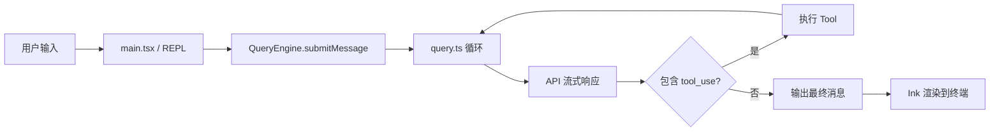

# 第 1 章：一次请求的完整旅程

## 问题定义

理解 Claude Code 最直接的方式，不是先拆模块，而是追踪一条用户消息从终端输入到最终渲染的完整旅程。本章沿用 `other-ans/ch01.md` 的主线，把“输入、编排、调用模型、执行工具、回写状态、更新 UI”串成一条连续链路。

## 架构分析

用户按下回车后，实际经历的是一条多阶段流水线：CLI 入口完成启动优化，`QueryEngine` 把当前对话和环境拼成一次查询，再由 `query.ts` 驱动循环式地调用模型、执行工具、回注结果。UI 并不是在末尾一次性刷新，而是消费 `AsyncGenerator` 产生的流式事件，因此文本、工具进度、错误恢复都能边发生边显示。

## 关键源码锚点

- `src/main.tsx`：CLI 主入口，负责启动时的预取、命令解析和 REPL 启动。
- `src/QueryEngine.ts`：查询门面，负责把用户输入转为一次完整的 turn。
- `src/query.ts`：真正的 Agent 循环，负责流式处理和继续/终止判断。
- `src/services/api/claude.ts`：模型调用与 usage 汇总。
- `src/tools.ts`：工具池组装入口。
- `src/ink/`：终端渲染栈。

## 快照修正与补充

- `docs/00-architecture-overview.md` 把系统概括为命令层、工具层、引擎层、服务层、状态层、UI 层；本章强调的是这几层在一次 turn 中如何被串联。
- `other-ans` 将启动与查询描述得更像单线程主链路，但当前快照里 `src/main.tsx` 明确在模块导入初期并行触发了 MDM 读取和 keychain 预取。
- 外部快照中很多内部能力仍然有入口或门控代码，但默认构建并不会把这些路径全部激活，见 `scripts/build.ts`。

## 设计启示

- 用一条端到端旅程建立认知，比先解释单个模块更容易看清职责边界。
- `AsyncGenerator` 是终端 Agent 的关键原语，因为它同时满足流式输出、状态保留和可中断三件事。
- 真实系统不是“先推理、后渲染”，而是“推理、执行、渲染、恢复”多条子流程交织推进。
