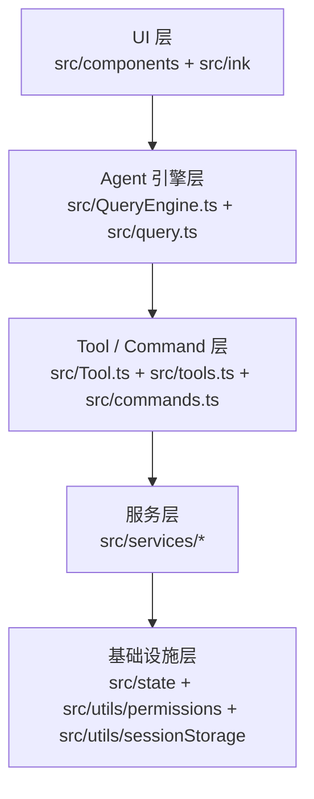

# 第 2 章：架构分层与模块划分

## 问题定义

Claude Code 不是单个“大而全”脚本，而是一套分层的终端 Agent 系统。本章沿用 `other-ans/ch02.md` 的四层视角，但按当前快照把它落到真实目录上。

## 架构分析

从代码组织上看，这个项目更接近“多层门面 + 横切基础设施”的结构。最外层是 CLI 与终端 UI，核心层是 QueryEngine 与 query 循环，再往下是 API、MCP、OAuth、Compact、插件等服务，最底层则是状态、权限、沙箱、会话存储和配置。

## 关键源码锚点

- `src/main.tsx`：连接启动、命令和交互式界面。
- `src/commands.ts`：命令注册表，负责 slash command 的统一入口。
- `src/tools.ts`：Tool 注册表，负责能力池组装。
- `src/services/`：API、MCP、OAuth、Compact、Plugin 等跨模块服务。
- `src/state/`：应用状态和响应式更新入口。
- `src/utils/permissions/`：权限规则、模式和运行时检查。

## 快照修正与补充

- `other-ans` 用“四层架构”叙事很清晰，但当前快照里 Tool/Command 实际是两套横向能力系统，分别服务于模型调用和用户显式命令。
- `docs/00-architecture-overview.md` 中的“Command Layer”和“Tool Layer”是独立列出的；本章保留这一点，不把二者混成单一能力层。
- 多 Agent、Bridge、Teleport 等能力虽然在目录中存在，但一部分受 feature gate 或内部依赖影响，需要按“可见接口 + 受限实现”来理解。

## 设计启示

- 好的分层不是为了教科书式整齐，而是为了把“可变的 Agent 行为”和“稳定的运行时约束”拆开。
- 对终端 Agent 来说，UI、Tool、Service、State 的边界要比传统 CLI 更清晰，否则很容易把权限、状态和渲染耦在一起。
- 目录结构本身就是架构意图的第一份文档。
