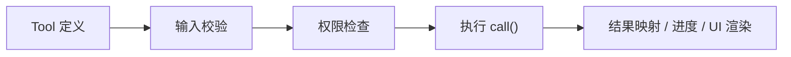

# 第 14 章：工具架构——统一接口与注册表

## 问题定义

Claude Code 的核心能力不是“会聊天”，而是能调用一组结构统一的 Tool。文件读写、Shell、搜索、MCP、子 Agent、任务管理都被纳入同一个工具接口体系。

## 架构分析

`src/Tool.ts` 定义了 Tool 的公共契约：名称、输入 Schema、输出映射、权限检查、并发安全、只读属性、执行方法、进度与渲染。`src/tools.ts` 则负责把内置工具、门控工具和平台相关工具组装成实际的工具池。Tool 之所以能统一调度和统一权限，根本原因就在于这些能力都遵守同一套元数据接口。

## 关键源码锚点

- `src/Tool.ts`
- `src/tools.ts`
- `src/tools/`
- `src/services/tools/`
- `src/Tool.ts`

## 快照修正与补充

- `docs/03-tool-system.md` 给了一个简化版 Tool 接口，而实际 `src/Tool.ts` 中的定义更丰富，也更强调上下文、验证和结果映射。
- `other-ans/ch14.md` 对 `buildTool` 和安全默认值的分析与当前快照方向一致。
- 工具排序与条件注册都很重要，因为它们会影响模型看见的能力集合。

## 设计启示

- 工具不应只是函数集合，而应该是自描述、自校验、可受控的能力对象。
- 统一接口是权限系统和并发调度得以通用化的前提。
- Agent 系统里的“工具注册表”本质上就是能力边界的声明。
