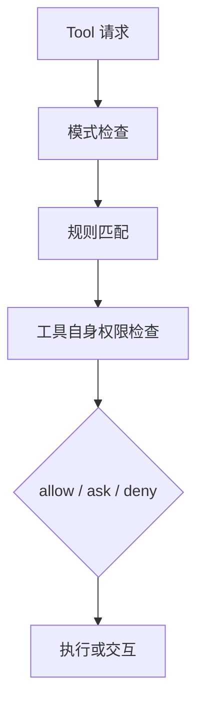

# 第 20 章：权限模型——信任与控制

## 问题定义

终端 Agent 的问题从来不只是“能做什么”，而是“在什么信任前提下允许它做”。Claude Code 通过 `Permission Mode` 和规则系统，把信任关系编码成运行时策略。

## 架构分析

权限系统同时包含三层：模式级策略、规则级匹配、工具级自检。模式决定整体倾向，比如默认询问、计划模式、接受编辑、完全绕过或自动拒绝；规则决定对特定工具、特定路径、特定 shell 前缀如何处理；工具级检查则确保高风险操作还能再加一道门。

## 关键源码锚点

- `src/utils/permissions/PermissionMode.ts`
- `src/utils/permissions/PermissionRule.ts`
- `src/utils/permissions/permissions.ts`
- `src/utils/permissions/permissionsLoader.ts`
- `src/utils/permissions/shellRuleMatching.ts`
- `src/hooks/toolPermission/`

## 快照修正与补充

- `docs/07-permission-system.md` 已给出模式表和检查步骤，本章进一步把它解释为“信任建模”问题。
- `other-ans/ch20.md` 对规则语法、来源层次、危险模式检测的总结，和当前目录中的 `shadowedRuleDetection.ts`、`dangerousPatterns.ts`、`permissionsLoader.ts` 能直接对应。
- 外部快照里即便存在 `bypassPermissions` 等模式，也不意味着所有敏感路径都会完全放开。

## 设计启示

- 权限模型的目标不是限制 Agent 的价值，而是把价值放进用户能理解的边界里。
- 把规则来源分层，是为了同时服务个人偏好、项目约束和企业策略。
- 只要允许 Shell 和文件写入，权限系统就必须成为架构核心，而不是附属配置。
