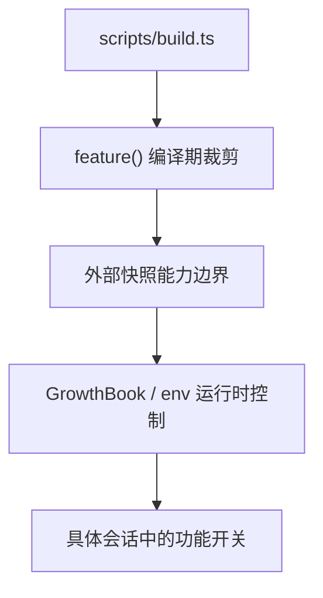

# 第 38 章：Feature Flag 与渐进式发布

## 问题定义

Claude Code 的很多能力并不是“一定存在”，而是由 build-time flag、runtime gate、环境变量和策略配置共同控制。理解这套门控机制，是理解外部快照与内部发行版差异的关键。

## 架构分析

当前快照至少存在三类门控：`scripts/build.ts` 中的 `feature()` 死代码边界、GrowthBook 远程配置、环境变量开关。前者决定代码是否会进入外部构建，后两者决定会话运行时行为。这使同一份代码可以支持内部/外部、实验/稳定、简化/完整等多种变体。

## 关键源码锚点

- `scripts/build.ts`
- `src/entrypoints/cli.tsx`
- `src/main.tsx`
- `src/services/analytics/growthbook.ts`
- `src/tools.ts`
- `src/commands.ts`

## 快照修正与补充

- `other-ans/ch38.md` 强调渐进发布，本仓库中的外部构建脚本正是最直接证据：大量内部能力在构建时即被设为 `false`。
- `docs/01-entrypoint-and-startup.md` 对 feature-gated 启动路径有清单式说明，本章把它上升为发布策略问题。
- 文档写作时必须始终区分“源码里有入口”和“当前外部构建默认可用”。

## 设计启示

- Feature flag 不只是实验功能开关，也是产品线和发行版边界。
- 编译期裁剪与运行时远程配置结合，能兼顾包体、稳定性与灰度能力。
- 对快照型项目做文档时，门控机制本身就是一章核心内容，而不是附录。
