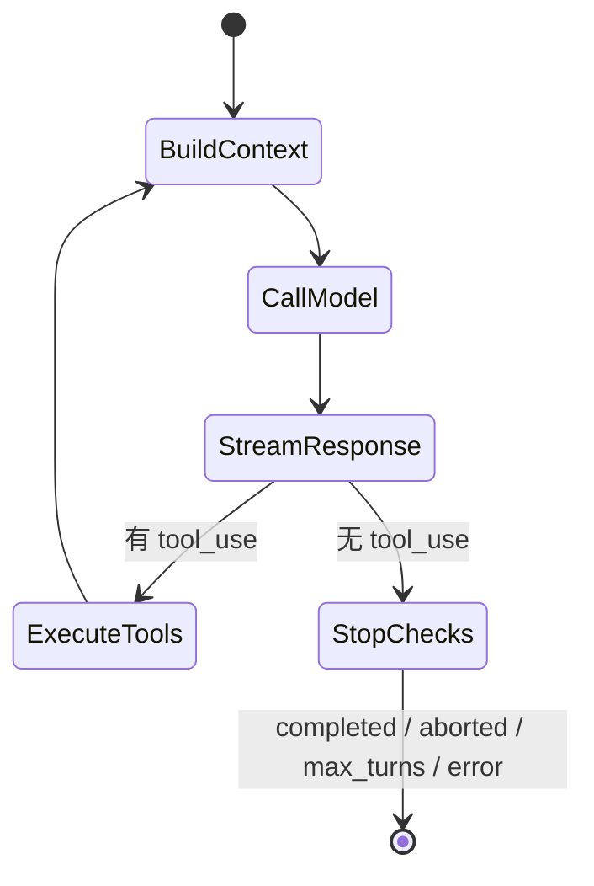

# 第 5 章：Agentic Loop——Agent 的心脏

## 问题定义

一个 Agent 真正的核心不是“调用一次模型”，而是一个能多轮继续、能插入工具、能在异常时恢复或退出的循环。`other-ans/ch05.md` 聚焦这一点，而当前快照的主实现落在 `src/query.ts`。

## 架构分析

`query.ts` 维护一份跨轮次的循环状态：消息历史、压缩追踪、工具上下文、恢复计数、turn 计数、continue reason。每一轮大体都会经历：整理消息、检查上下文预算、调用模型、解析事件、执行工具、注入结果、决定继续还是终止。

## 关键源码锚点

- `src/query.ts`
- `src/query/config.ts`
- `src/query/deps.ts`
- `src/QueryEngine.ts`
- `src/services/api/claude.ts`
- `src/utils/messages.ts`

## 快照修正与补充

- `../06-query-engine.md` 中的 `LoopState` 定义能够直接映射到 `other-ans` 对循环状态机的解释。
- 当前快照并不把所有 continue path 都抽成显式状态枚举，而是以 `transition`、恢复计数和若干辅助函数组合控制。
- 循环的实际复杂度来自“恢复”和“约束”，不是单纯的 `while(true)`。

## 设计启示

- Agentic Loop 的价值在于可恢复、可中断、可观察，而不是无限自主。
- 把消息、预算、工具、副作用都收束到同一个循环状态对象，是控制复杂度的关键。
- 如果没有严谨的终止条件，Agent 很容易陷入无限继续或错误重试。

