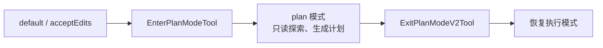

# 第 8 章：Plan Mode——思考与行动的分离

## 问题定义

Plan Mode 解决的是 Agent 的经典风险：模型一边理解问题，一边直接开始修改文件，容易在上下文不足时做出错误动作。当前快照通过权限模式和专用 Tool，把“分析阶段”和“执行阶段”明确隔开。

## 架构分析

Plan Mode 并不是独立运行时，而是 `Permission Mode` 的一种特殊语义。进入计划模式后，系统只暴露只读和计划相关能力；退出时，再恢复可以执行变更的工具池。`EnterPlanModeTool` 和 `ExitPlanModeV2Tool` 负责引导模型切换阶段，查询循环和权限系统负责真正收紧边界。

## 关键源码锚点

- `src/tools/EnterPlanModeTool/`
- `src/tools/ExitPlanModeTool/`
- `src/utils/permissions/PermissionMode.ts`
- `src/utils/permissions/permissions.ts`
- `src/query.ts`

## 快照修正与补充

- `../07-permission-system.md` 已明确把 `plan` 作为外部可见模式之一，本章是在此基础上强调其“阶段隔离”意义。
- `other-ans/ch08.md` 提到 plan 文件、访谈阶段、teammate 场景；当前快照中这些周边能力并不都以同一形式完整开放，因此手册保留概念，但只把源码可见部分当作确定事实。
- Plan Mode 的本质是权限收敛，不是单独的“第二套 Agent”。

## 设计启示

- 让 Agent 先规划、后执行，是提升可靠性的低成本方式。
- 规划模式最稳妥的落点是权限系统，而不是只靠提示词约束。
- 只读阶段越清晰，后续写操作越容易被审核和追踪。

