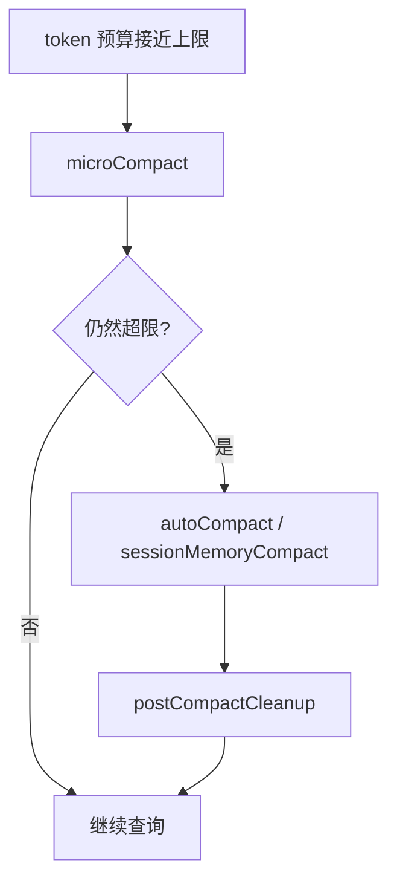

# 第 12 章：上下文压缩与摘要（Compact）

## 问题定义

长对话不可避免地逼近窗口上限，因此压缩不是补救措施，而是长期运行 Agent 的常规能力。当前快照把 Compact 设计成独立服务族，而不是塞进 QueryEngine 的若干散乱判断里。

## 架构分析

`src/services/compact/` 下同时存在自动压缩、微压缩、SessionMemory 参与的压缩和压缩后清理逻辑。主循环只负责判断是否进入压缩路径，具体如何生成摘要、何时中止、如何恢复文件上下文，则委托给 compact 服务完成。

## 关键源码锚点

- `src/services/compact/compact.ts`
- `src/services/compact/autoCompact.ts`
- `src/services/compact/microCompact.ts`
- `src/services/compact/sessionMemoryCompact.ts`
- `src/services/compact/postCompactCleanup.ts`
- `src/query.ts`

## 快照修正与补充

- `other-ans/ch12.md` 把 Compact 分为 MicroCompact、Session Memory Compact 和 Legacy Compact，这个分层在当前目录结构中依然能看到。
- `../02-service-layer.md` 只把 compact 当作服务目录之一，本章补足其在长会话中的核心地位。
- 当前快照里压缩路径还会与 feature gate、Prompt Cache、错误恢复耦合，因此它不只是“总结历史”，也是“守住会话继续运行”的保险丝。

## 设计启示

- 摘要系统应该是一个有状态、有失败处理、有恢复动作的子系统，而不是一次 API 调用。
- 压缩后如何恢复文件和工具上下文，和压缩本身一样重要。
- 对长会话 Agent 来说，Compact 实际上是第二条控制主链。

