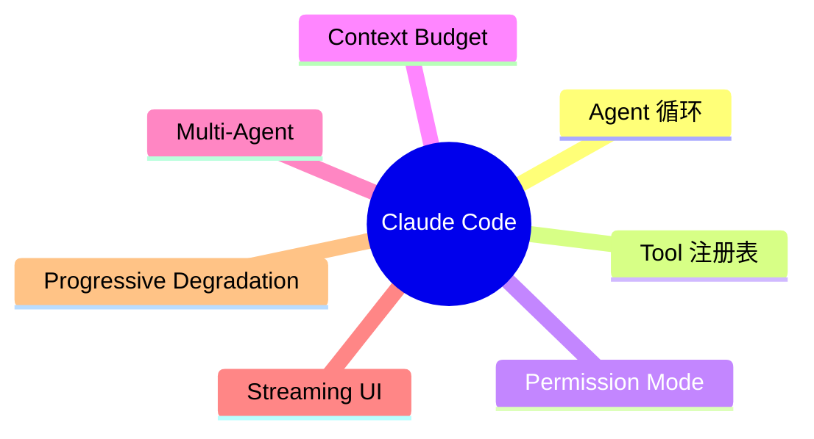

# 第 45 章：架构模式总结与启示

## 问题定义

在 45 章细节之后，更重要的问题是：这份代码快照反复使用了哪些架构模式？哪些模式值得迁移到其他 Agent 项目中？

## 架构分析

综合前文，可以把 Claude Code 的核心模式归纳为七类：Agent 循环模式、统一工具注册表、权限中间件、上下文预算、多 Agent 委派、流式处理、渐进降级。它们共同解决的，是“如何把一个高能力但不稳定的模型执行体收束成可控的软件系统”。

## 关键源码锚点

- `src/query.ts`
- `src/Tool.ts`
- `src/utils/permissions/`
- `src/services/compact/`
- `src/tools/AgentTool/`
- `scripts/build.ts`

## 快照修正与补充

- `other-ans/ch45.md` 的七个模式总结与当前快照高度契合，本手册所做的主要工作是把它们逐一落到真实目录与门控边界上。
- `../00-architecture-overview.md` 给了模块分层视角，而本章试图补出“跨模块反复出现的设计模式”视角。
- 对外部快照来说，“渐进降级”尤其重要，因为它直接解释了为什么缺失内部包后系统仍能构建与运行。

## 设计启示

- 一个可靠的 Agent 系统，核心不是让模型更像人，而是把模型包进更像软件的边界里。
- 真正可复用的不是某个 Prompt，而是 QueryEngine、Tool、Permission、Compact、State、UI 之间的协作模式。
- 阅读这份代码时，最好把它当作“Agent 工程学”案例，而不只是一个 CLI 项目。

